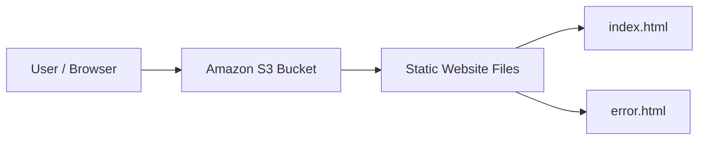
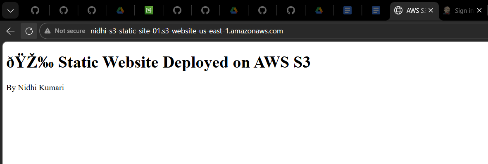
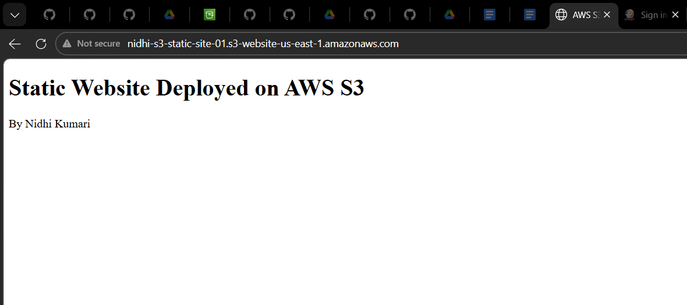

# 🌐 AWS S3 Static Website

A beginner-friendly AWS project that demonstrates how to host a simple static website using **Amazon S3 Static Website Hosting**.

This project focuses on the fundamentals of AWS S3, public website hosting, HTML file deployment, and verifying a website through the S3 website endpoint.

---

## 📌 Project Overview

The goal of this project was to deploy a basic static website on AWS using Amazon S3.

The website contains:

- `index.html` — main webpage
- `error.html` — error page

The project demonstrates the basic process of creating an S3 bucket, uploading website files, enabling static website hosting, configuring public access, and opening the website in a browser.

---

## 🏗️ Simple Architecture



### Request Flow

```text
User
  ↓
Web Browser
  ↓
Amazon S3 Static Website Endpoint
  ↓
index.html
```

---

## 🛠️ AWS Service Used

| Service | Purpose |
|---|---|
| Amazon S3 | Stores the HTML files and hosts the static website |

---

## 📁 Project Structure

```text
AWS-S3-Static-Website/
│
├── index.html
├── error.html
├── screenshots/
│   ├── s3-project-screenshot-1.png
│   └── s3-project-screenshot-2.png
└── README.md
```

---

## 🚀 Deployment Steps

### 1. Create an S3 Bucket

Create a new Amazon S3 bucket for the website files.

### 2. Upload Website Files

Upload:

```text
index.html
error.html
```

### 3. Enable Static Website Hosting

Open the S3 bucket properties and enable:

```text
Static website hosting
```

Configure:

```text
Index document: index.html
Error document: error.html
```

### 4. Configure Public Access

Configure the bucket permissions required for the website files to be publicly accessible.

### 5. Open the Website

Use the S3 static website endpoint to open the deployed website in a browser.

---

## 📸 Project Screenshots

### Project Screenshot 1



### Project Screenshot 2



---

## 📚 What I Learned

Through this beginner AWS project, I practiced:

- creating an Amazon S3 bucket
- uploading website files to S3
- understanding S3 objects
- enabling static website hosting
- configuring an index document
- configuring an error document
- working with public access settings
- accessing a website through the S3 website endpoint

---

## 🎯 Project Purpose

This project is intentionally kept simple.

It represents a foundational AWS exercise before moving on to more advanced projects involving services such as load balancers, auto scaling, containers, Kubernetes, and CI/CD pipelines.

---

## 👩‍💻 Author

**Nidhi Kumari**

GitHub: [Nidhi8901](https://github.com/Nidhi8901)

LinkedIn: [Nidhi Kumari](https://www.linkedin.com/in/nidhi-kumari-ba2a1a361)

---

⭐ A simple hands-on project for learning the fundamentals of hosting static websites on AWS S3.
